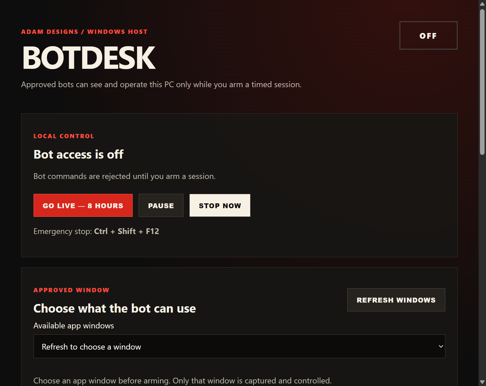

# BotDesk Free

A free Windows companion for Grok bot owners using a compatible tool runner.

Let approved bots operate one selected app window on your Windows PC while you are away. Use your private phone dashboard to go live now, set a countdown, schedule a dated window such as **6 AM to 6 PM**, pause access, or turn it off.

**Development baseline. The relay is not deployed or paired, and remote phone access is not live.** Local simulations are not proof of a phone controlling a real desktop. See the [quick start](docs/QUICKSTART.md), [troubleshooting](docs/TROUBLESHOOTING.md), [setup reference](docs/SETUP.md), [setup audit](docs/setup-audit.md), [verification](docs/VERIFICATION.md), and [security boundaries](docs/SECURITY.md). Owner-facing text calls the product **Bot Door**; the code, package and window title still say BotDesk.

## Owner controls

- GO LIVE defaults to eight hours, with a maximum of twelve hours.
- Schedule a start and end time from the phone, in the phone's displayed timezone. This is one dated window, not a daily recurring schedule.
- The dashboard shows time remaining. Start and stop happen automatically without a phone page staying open or anyone confirming at the PC.
- A brief network interruption stops commands; reconnection can resume within the saved owner-authorized window. OFF and PAUSE cancel that window.
- The local STOP button and Ctrl+Shift+F12 cancel access and lock remote arming until someone unlocks the local stop.
- The PC must stay awake and signed in, with BotDesk running and an approved target selected. Restarting BotDesk requires target selection again. It does not power on or unlock Windows.

## Bot tools

BotDesk is independent software, not an official xAI product. It does not sign into Grok or add tools to the standard Grok chat. Your bot runner must be able to launch the included MCP adapter.

The MCP adapter exposes twelve tools over stdio using the official MCP SDK: status, screenshot, accessible-page snapshot, target-window information, guarded focus of the already-approved window, click, type, limited key presses, scroll, recording start/stop, and stop all. Dynamic MCP is not supported. Only one bot can operate the selected window at a time. After arm, if another window takes the foreground, `botdesk_focus` asks Windows to restore that same HWND/PID only; it never picks a different window, and it fails closed if Windows refuses.

Input needs a fresh screenshot or snapshot. The host checks the target, process, Windows permissions, sensitive content signals, session deadline and command identity before acting. Screenshots capture only the selected window. Local WebM recordings use guarded snapshots at roughly one frame per second, without audio; they are suitable for test evidence, not smooth promotional footage.

## Local commands

```powershell
npm ci
npm run check
node scripts/desktop-smoke.mjs
node scripts/recording-smoke.mjs
npm run build:win
node scripts/desktop-smoke.mjs --packaged
```

The Windows portable build is `dist/BotDesk-0.1.0-portable.exe`. This development build is unsigned. Pairing secrets stay outside the repository and are encrypted by Windows when saved in the host.

The host's Connection card names the reason it is not connected (rejected token, another copy connected, relay unreachable, and so on), runs a compile-only check of the Windows helper, and **COPY DIAGNOSTIC REPORT** produces a redacted report for support. Startup failures are shown in a dialog and written to `logs/startup-errors.log`.

Closing BotDesk's window hides it to the tray; Quit BotDesk ends the host. Automatic startup is optional and is not enabled by this build process.

## Preview



[Phone schedule preview](docs/images/phone-schedule.png)
