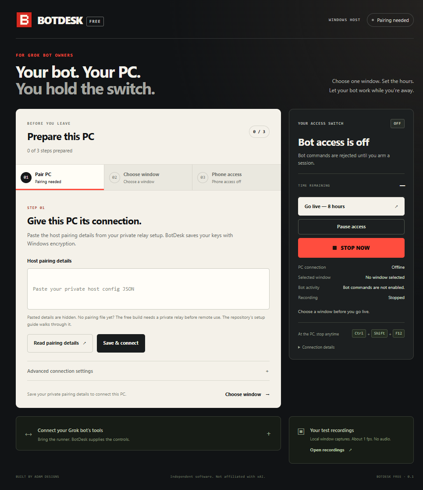

# BotDesk Free

A free Windows companion for Grok bot owners using a compatible tool runner.

Let approved bots operate one selected app window on your Windows PC while you are away. Use your private phone dashboard to go live now, set a countdown, schedule a dated window such as **6 AM to 6 PM**, pause access, or turn it off.

**Development baseline. The relay is not deployed or paired, and remote phone access is not live.** Local simulations are not proof of a phone controlling a real desktop. See [verification](docs/VERIFICATION.md), [setup](docs/SETUP.md), and [security boundaries](docs/SECURITY.md).

## Prepare this PC

After [setting up and provisioning your private relay](docs/SETUP.md), use the host's three tabs:

1. **Pair PC:** paste the host pairing JSON, choose **Read pairing details**, then **Save & connect**.
2. **Choose window:** open the target app, choose **Refresh**, and select its window.
3. **Phone access:** enable **Allow access from my phone**, choose **Save phone settings**, then **Copy private phone link** for yourself.

Keep Windows awake and unlocked. Use **Go live — 8 hours** or the phone schedule when ready. Connect a compatible bot runner separately using the [MCP setup instructions](docs/SETUP.md#connect-the-approved-bot); give it only the bot credential.

## Owner controls

- GO LIVE defaults to eight hours, with a maximum of twelve hours.
- Schedule a start and end time from the phone, in the phone's displayed timezone. This is one dated window, not a daily recurring schedule.
- The dashboard shows time remaining. Start and stop happen automatically without a phone page staying open or anyone confirming at the PC.
- A brief network interruption stops commands; reconnection can resume within the saved owner-authorized window. OFF and PAUSE cancel that window.
- The local STOP button and Ctrl+Shift+F12 cancel access and lock remote arming until someone unlocks the local stop.
- The PC must stay awake and signed in, with BotDesk running and an approved target selected. Restarting BotDesk requires target selection again. It does not power on or unlock Windows.

## Bot tools

BotDesk is independent software, not an official xAI product. It does not sign into Grok or add tools to the standard Grok chat. Your bot runner must be able to launch the included MCP adapter.

The MCP adapter exposes eleven tools: status, screenshot, accessible-page snapshot, target-window information, click, type, limited key presses, scroll, recording start/stop, and stop all. MCP is the standard interface that lets a bot call these tools. Only one bot can operate the selected window at a time.

Input needs a fresh screenshot or snapshot. The host checks the target, process, Windows permissions, sensitive content signals, session deadline and command identity before acting. Screenshots capture only the selected window. Local WebM recordings use guarded snapshots at roughly one frame per second, without audio; they are suitable for test evidence, not smooth promotional footage.

## Local commands

```powershell
npm ci
npm run check
node scripts/desktop-smoke.mjs
node scripts/onboarding-smoke.mjs
node scripts/recording-smoke.mjs
npm run build:win
node scripts/desktop-smoke.mjs --packaged
```

The Windows portable build is `dist/BotDesk-0.1.0-portable.exe`. This development build is unsigned. Pairing secrets stay outside the repository and are encrypted by Windows when saved in the host.

Closing BotDesk's window hides it to the tray; Quit BotDesk ends the host. Automatic startup is optional and is not enabled by this build process.

## Preview

Synthetic setup and phone previews; these images do not show a live pairing.



[Synthetic phone schedule preview](docs/images/phone-schedule.png)
