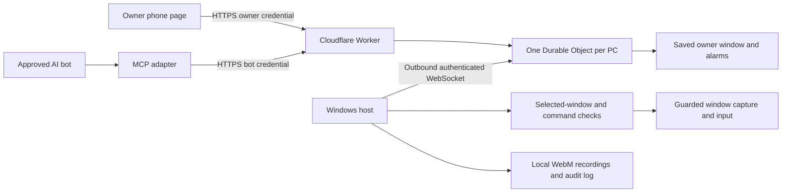

# BotDesk architecture

BotDesk consists of a Windows host, a Cloudflare relay, an owner phone page, and a bot MCP adapter. The relay is implemented and locally tested; it has not been deployed.

## Credentials and routing

Provisioning creates a host ID and independent host, owner, and bot credentials. The relay stores SHA-256 hashes of those three credentials, not the raw values. Provisioning itself requires a separate `PROVISIONING_SECRET` Worker secret. The provisioning script reads its copy from `BOTDESK_PROVISIONING_SECRET`, requires a private `--out` file, and does not print the credentials.

The owner credential can create or cancel a time window. The bot credential can request actions within an owner-authorized session but cannot arm the PC or modify a schedule. The host credential authenticates the Windows connection. The local host also holds the owner credential for its local GO LIVE and PAUSE controls; bot clients must never receive it.

The phone link stores the owner credential in a URL fragment. The fragment is not sent in the HTTP request; dashboard JavaScript sends the credential in an Authorization header. Host WebSocket credentials are checked in the HTTP upgrade header before accepting the socket. Bot commands also use Authorization headers. Query parameters are rejected, and host authentication does not use an unauthenticated first-message exchange.

The Worker exposes exact routes and invokes named Durable Object methods. The object's `fetch` handler handles only the authenticated host WebSocket upgrade. Provisioning also rechecks the provisioning secret inside the object, preventing a generic HTTP forwarding route from bypassing that check.

## Owner windows and automatic operation

The relay persists only credential hashes and an explicitly owner-authorized window, represented by an ID, `startsAt`, and `endsAt`. Active command state, leases, and live-mode claims are not persisted.

**GO LIVE** creates an immediate saved window: eight hours by default, at most twelve. **SAVE SCHEDULE** creates one dated start/end window, at most twelve hours long. The phone converts its local datetime inputs into absolute timestamps; the relay does not reinterpret the phone's timezone. The first version does not repeat the schedule daily.

Cloudflare Durable Object alarms start scheduled access and end it at the saved time. A prepared host that reconnects inside the saved window may resume automatically. Before the start, after the end, or without a saved window, it remains OFF. An offline host is retried no faster than every thirty seconds, and never beyond the window's end. A new authenticated connection also checks the saved window immediately.

Every start, including a reconnect, uses the same automatic host acknowledgement:

1. The relay remains OFF and sends `owner_state` with a unique request ID, control generation, mode, and exact expiry.
2. The host verifies remote arming is enabled, the emergency-stop latch is clear, and an approved target exists. It attempts to focus that target and applies its local checks without prompting a person.
3. The host replies `owner_state_result`. The relay accepts only the matching request, generation, mode, and expiry.
4. Only a successful matching acknowledgement permits commands. A rejected or timed-out request does not create a live session.

The local session deadline and relay deadline independently stop access. The owner phone reports `schedule`, `schedulePending`, `liveEndsAt`, and `scheduleError`, plus a live/start countdown. A saved window can be pending while the PC is offline; saving it is not a claim that the PC is live.

Phone OFF and PAUSE delete the saved window and cancel pending commands. A subsequent owner GO LIVE can start another window. The host's local emergency stop also deletes the window and latches a local stop; remote attempts cannot unlock that latch. A scheduled arm rejected because remote arming is disabled or the local stop is latched cancels that saved window rather than retrying indefinitely.

## Connection and command lifetime

One authenticated host socket is accepted per PC. Standard, non-hibernating WebSockets deliberately retain the active connection state; their connected runtime has a Cloudflare billing cost. A Worker restart discards its live-mode claim. The persisted owner window may authorize a fresh host handshake, but the relay does not restore an old command or assume the PC is armed.

The host sends heartbeats every ten seconds. The relay drops a host that has not refreshed its heartbeat for thirty seconds. Host disconnect immediately clears current live state, rejects pending commands, and preserves only an explicit unexpired owner window for reconnection.

The relay allows one command in flight and rejects concurrent requests instead of queueing them. Each accepted command has a fresh command ID, a maximum twenty-second deadline, and the current control generation. HTTP requests require unique IDs; recent duplicates are rejected. The replay/rate budget is bounded, and exhausting it cannot block a safety stop.

A bot holds a renewable sixty-second lease, bounded by the owner window's expiry. Other bot IDs cannot take over that lease. Owner previews do not acquire or replace it. Status and stop actions remain available outside live mode; stopping a recording does not require a bot lease.

Pause, stop, disconnect, expiry, or a new control generation invalidates pending work. Late host replies cannot arm a different generation or complete a superseded request. Request bodies and host frames are bounded, and rejected input does not create a command queue.

## Windows execution boundary

The host runs as an ordinary Windows application. It controls the PC on which it is installed through a fixed Windows helper. It is not a shell or arbitrary script execution service.

Before leaving, the owner selects one allowed app window and enables remote arming. The host records the window handle and process identity in memory. Windows must remain signed in, awake, and unlocked, and the selected app must remain available. If the host application or Windows restarts, the owner must select a target again; automatic startup does not restore a target or bypass the lock screen. Network and relay reconnects can resume a still-prepared host inside its saved window.

Capture and input are limited to the selected window. The host verifies normal Windows privileges and available UI Automation data, rejects password controls and blocked window categories, and applies an app allowlist. Unknown privilege or automation state fails closed. Shells, developer tools, Windows security controls, financial windows, and sign-in/password windows are blocked.

Input requires a recent snapshot belonging to the current bot and control generation. The target identity and geometry must still match, and each input consumes the snapshot. Click coordinates are relative to the selected-window capture. Native checks run again at the execution boundary; asynchronous work is cancelled when a stop or new generation arrives.

These checks are layered safeguards, not a guarantee that arbitrary third-party app content is safe. The supported surface is the owner-selected, allowed Windows app under the documented checks. There is no UAC approval, lock-screen access, unattended target selection, or general filesystem/shell tool.

## Local evidence and media

Screenshots travel through the relay on demand and are not stored there by this application. The phone clears the displayed preview when hidden or no longer live. The current preview is a captured frame, not a continuous desktop stream.

The recording service accepts already-guarded selected-window frames and writes local WebM files under the host application-data `captures` directory. The capture rate is up to one frame per second and there is no audio. The relay does not automatically upload recordings. The host also writes local audit records under `logs`; it does not log typed command contents or pairing secrets.

Local integration tests exercise real Worker HTTP/WebSocket routing, storage and alarms, role authentication, replay/concurrency controls, stop behaviour, restart/reconnect windows, and the actual HostController/RelayClient protocol with a simulated native executor. That simulation does not by itself prove real Windows capture/input or an internet deployment; those are separate validation steps.
