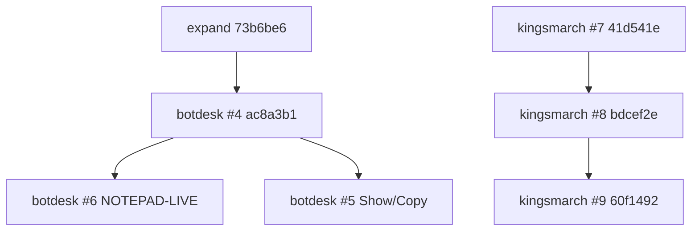

# BotDOOR + Kingsmarch review

**For:** Adam / Codex (phone-readable)  
**As of:** 2026-09-13 · heads re-checked on GitHub this write  
**Author:** Morgan (cloud). AlienAdam live tests **wait on arm**.  
**This PR:** docs only. **Do not merge. Do not deploy. Do not rotate credentials.**

Public names: **Bot Door** (product) / **BotDesk** (this tree). **Kingsmarch** = `kingsage-remaster`.

**CI / fixtures / desktop Chrome smokes are not live PASS.** Only a completed AlienAdam or Studio evidence folder (or Adam-written S-09 / G-02) can flip a live row.

---

## Current heads (Morgan)

Verified still the branch tips. Short SHA = the id Morgan already uses.

### Bot Door — [botdesk](https://github.com/Adamdesgns/botdesk)

| PR | Head | Branch | What | Live? |
| --- | --- | --- | --- | --- |
| **[#4](https://github.com/Adamdesgns/botdesk/pull/4)** draft | `ac8a3b1` `ac8a3b10d91eb34183d80567f6ac72ead803f310` | `cursor/expand-review-fix-eec6` | expand + empty-save + `botdesk_focus` fail-closed + Linux CI | **No live PASS** |
| **[#5](https://github.com/Adamdesgns/botdesk/pull/5)** draft | `47586a8` `47586a812e89a92e93b8c19cef1138e2b62a6d4e` | `cursor/owner-phone-bot-token-3bc9` | owner-phone Show/Copy of the **existing** bot token; Hide/stale-retrieve; Safari second-tap | **Not deployed.** Real Safari unproved |
| **[#6](https://github.com/Adamdesgns/botdesk/pull/6)** draft | `fa2a065` `fa2a06556f46e62e9b486306d2599f95b0666597` | `cursor/notepad-live-checklist-10f1` | `docs/NOTEPAD-LIVE.md` next-boot checklist | Docs. **Not** a live run |

#4 sits on AlienAdam expand `claude/windows-control-expand` @ `73b6be6`. That is **not** the merged PR #3 line (`codex/botdesk-v1`).

Older surveys (not these heads): [botdesk #1](https://github.com/Adamdesgns/botdesk/pull/1), [botdesk #2](https://github.com/Adamdesgns/botdesk/pull/2).

### Kingsmarch — [kingsage-remaster](https://github.com/Adamdesgns/kingsage-remaster)

| PR | Head | Branch | What | Live? |
| --- | --- | --- | --- | --- |
| **[#8](https://github.com/Adamdesgns/kingsage-remaster/pull/8)** open | `bdcef2e` `bdcef2e7c16a6fa83215d2c34a0e2e07bf449bfd` | `cursor/practice-touch-scroll-da9e` | `TouchScroll` (wheel + button-start drag + one-finger own) | Studio **NOT RUN** on this tip |
| **[#9](https://github.com/Adamdesgns/kingsage-remaster/pull/9)** draft | `60f1492` `60f14929164d8051378732b200b84661d1e4c230` | `cursor/practice-pack-reconcile-dfeb` | Morgan Studio boot runbook (S-07 then S-03) | Docs only |

Parent, **keep draft:** [kingsmarch #7](https://github.com/Adamdesgns/kingsage-remaster/pull/7) `cursor/practice-phase1-d06-c4e2` @ `41d541e` `41d541e9cabc5c6006b1e9f57fd17be39aaa7b6d`.

**Play `bdcef2e`, not the docs tip.** Do not Play `41d541e` / `0f3625a`.

---

## Stack / overlaps

| Pair | Relationship | Deploy / arm |
| --- | --- | --- |
| #6 → #4 | Docs **target the expand line of #4.** Same host contract `1.1.0`. No code. | Next AlienAdam boot. Host rebuild ≠ adapter ≠ relay. |
| #5 → #4 | Git base is #4, but this is a **separate deploy**: relay owner retrieve + phone page. | **Not** a Notepad gate. Do not block #4 live Notepad on Safari Copy. |
| #4 vs #3 | #3 empty-save/focus already merged to `codex/botdesk-v1`. #4 **ported** blank-Save keep onto expand and **locked** explicit `botdesk_focus` to stored HWND/PID (no `executor.run` fallback). | Two lines. Do not treat #3 merge as expand shipped. |
| #9 → #8 | Docs on `bdcef2e`. No second scroll fix. | Cold-boot: S-07 first, S-03 next. |
| #8 → #7 | Code stacks on Phase 1 teaching. S-01 PASS on `41d541e` was **Adam-assisted** (list would not wheel-scroll). | **Does not transfer** to `bdcef2e`. G-01 stays open. |
| Bot Door ↔ Kingsmarch | Same PC / same night possible. Different repos, evidence, and gates. | Do not launder a Studio row into Notepad or the reverse. |

---

## Live gaps (blocked until arm / Adam)

AlienAdam is expected **off**. Cloud cannot press STOP, open Studio, or prove Safari.

### Bot Door

| Gap | Status | Why it is still open |
| --- | --- | --- |
| **Notepad matrix** | NOT RUN | [NOTEPAD-LIVE](https://github.com/Adamdesgns/botdesk/blob/cursor/notepad-live-checklist-10f1/docs/NOTEPAD-LIVE.md) on #6: screenshot → click → type (untitled, no save) → focus steal + explicit `botdesk_focus` → local STOP / Ctrl+Shift+F12 mid-drag → `mode=off` + rejected follow-up. Evidence: `evidence/notepad-live-*` / `RESULT.txt` = `PASS` (gitignored). |
| **`hostOnline`** | Requires a **running host** | Phone / owner status is `PC ONLINE` only while the Windows host holds the relay WebSocket. PC off, host quit, or Codex-virtualized AppData ≠ this. Schedule, preview, and #5 retrieve **fail closed** while offline. |
| **Phone Safari Show/Copy** | Fixture only | #5: Hide / `pagehide` / visibility clear the cache; stale retrieve must not win. **iPhone Safari** may refuse the first Copy after the network retrieve — second tap is the intended recovery. Desktop Chrome fixture **≠** S-phone / real Safari. Path not deployed. |
| **Studio / GPU (Bot Door)** | Parked | [STUDIO-TEST.md](STUDIO-TEST.md) is a **different target** from Notepad. Capture response ≠ GPU pixels. Live JPEG / drag / STOP-during-drag still U. |
| Browser / clipboard / monitors / E-WASD / reconnect | Unverified | Listed on #4. Not this boot’s Notepad gate. |
| MCP live install | CI only | `mcp/run-with-secret.sh` env-first is test-covered. Morgan box install is not. |

**Current Notepad host when NSIS portable is stuck:** `dist\win-unpacked\BotDesk.exe` from **`ac8a3b1`**, launched **outside Codex**. A host build does **not** update `mcp/server.mjs` or the Worker.

### Kingsmarch

| Gap | Status | Why it is still open |
| --- | --- | --- |
| **S-07** on `bdcef2e` | NOT RUN | Required next acceptance of `TouchScroll`. Wheel + drag-from-44px-button must move Village / War / planner; draw owns `RouteCanvas`; second finger does nothing. Emulator iPhone XR 896×414 is OK **for this row only**. |
| **S-03** | NOT RUN | After S-07. Try without a gate team → no redraw → Try this plan. Must be **FORT HELD**, losses **8 / 7 / 5**, `No squad was sent to open the gate.` |
| **S-01** on `bdcef2e` | NOT RUN | 2026-09-11 S-01 on `41d541e` (FORT TAKEN 5/5/4, training-only) needed Adam to reach Practice siege. Not an independent bot PASS. |
| **S-09** | NOT RUN | **Physical phone.** Adam writes it. Emulator / desktop-at-phone-width is **not** S-09. |
| **G-02** | Open | **Adam-written** yes/no (opening decisions). Silence ≠ approval. Not an emulator pass. |
| **G-01** | Open | Unfamiliar-player study + Adam. One S-07/S-03 does not close it. |
| S-02, S-04–S-06, S-08 | NOT RUN | Not required to start the boot. S-04 optional same session after S-03. |
| Phase 2 / publish | Out of scope | Do not start. Do not invent D-02 / OPEN-21. |

Boot script (PC): [2026-09-13 Morgan Studio runbook](https://github.com/Adamdesgns/kingsage-remaster/blob/cursor/practice-pack-reconcile-dfeb/docs/verification/2026-09-13-morgan-studio-boot-runbook.md) on #9. Inspect :4178 before kill. Health must be `{"ok":true,"service":"kingsage-world","contractVersion":1}`.

---

## Automated only (do not launder)

Recorded on those tips. **Not** AlienAdam. **Not** Studio. **Not** Safari.

| Tree | What ran | Not proved |
| --- | --- | --- |
| botdesk #4 `ac8a3b1` | Linux `npm run check`: 120 pass / 3 skip; relay types; MCP smoke 18 tools | Native compile, Notepad, Studio GPU, phone, deploy |
| botdesk #5 `47586a8` | 135 pass / 3 skip (incl. dashboard Hide / stale / second-tap fixture) | Real iPhone Safari, deployed retrieve |
| botdesk #6 `fa2a065` | Same check as #4 tree (docs) | Any live step |
| kingsmarch #8 `bdcef2e` | types; core 104; server 139; Luau incl. **11 touch-scroll**; persistence probe | Studio Play, physical phone, G-02 |

---

## Adam / Codex — review only

1. Read this page. Open the five PR links if you want the diffs.  
2. **Bot Door control surface:** #4 code + #6 checklist. Next boot = Notepad matrix on `ac8a3b1` unpacked exe.  
3. **Bot Door phone token:** #5 is a **separate** owner deploy (relay + phone). Confirm Safari on a real phone after that deploy — not before Notepad.  
4. **Kingsmarch:** Play detached `bdcef2e`. S-07 then S-03. Leave #7 draft. Leave G-01 open. S-09 and G-02 wait on you.  
5. Do **not** merge, `wrangler deploy`, publish Roblox, or rotate tokens from this package.

No tokens, pairing files, owner fragments, or AppData paths belong in chat or in `evidence/`.
